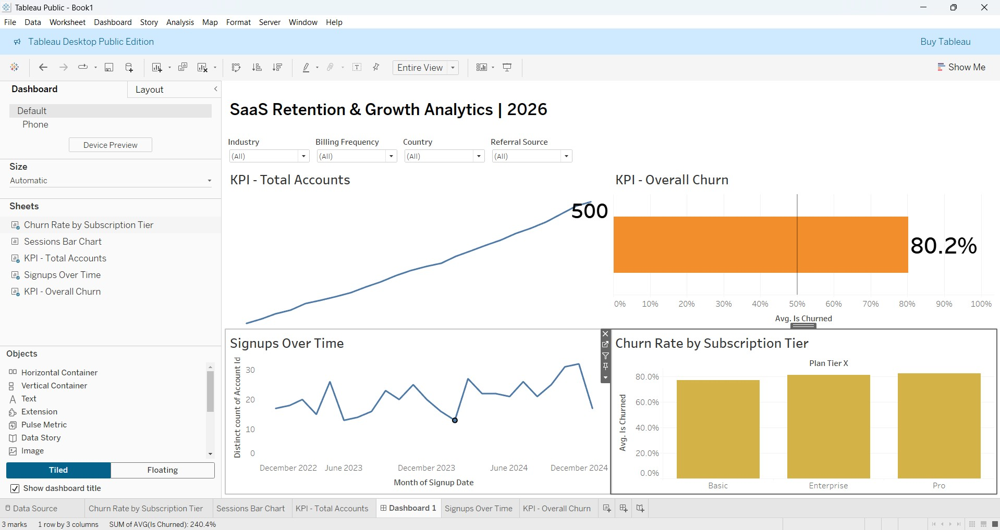

# SaaS Retention & Growth Analytics

*(Click the image above to view and interact with the live dashboard on Tableau Public)*

### Overview
This project features an interactive Tableau dashboard designed to analyze SaaS subscriber retention, growth trends, and churn metrics. The dashboard empowers stakeholders to track performance against a 50% churn target and identify key drivers of user drop-off to prevent revenue leakage.

### The Business Problem
The business lacked clear visibility into which user segments were churning the fastest and whether regional teams were meeting their retention goals. This dashboard solves that by providing an executive-level view of account growth and overall churn, allowing managers to instantly slice the data by Industry, Billing Frequency, Country, and Referral Source.

### Technical Toolset
* **Visualization:** Tableau Desktop / Tableau Public
* **Advanced Techniques Used:** * Dual-Axis Bullet Graphs (Target tracking)
  * Sparklines (Historical momentum tracking)
  * Global Parameter Filtering 
  * UI/UX Layout Containers and custom formatting

### Key Insights Discovered
* **Target Miss:** The business is currently missing its 50% retention target, sitting at a critical 80.2% overall churn rate.
* **Acquisition vs. Retention:** Despite the high churn rate, top-of-funnel marketing is performing well, driving historical momentum up to 500 total active signups. 
* **Tier Distribution:** Churn is relatively evenly distributed across the Basic, Enterprise, and Pro subscription tiers, indicating a global product-market fit issue rather than a tier-specific pricing problem.
